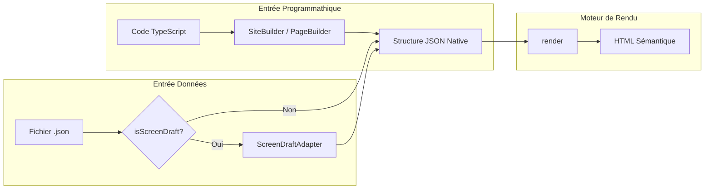
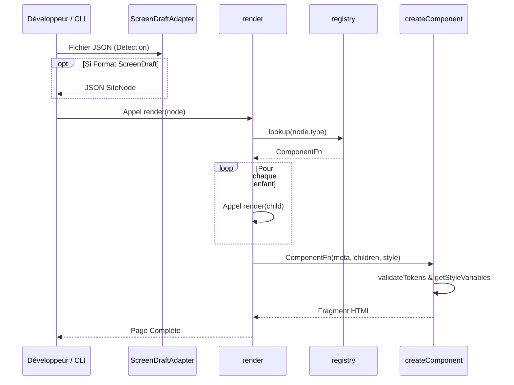
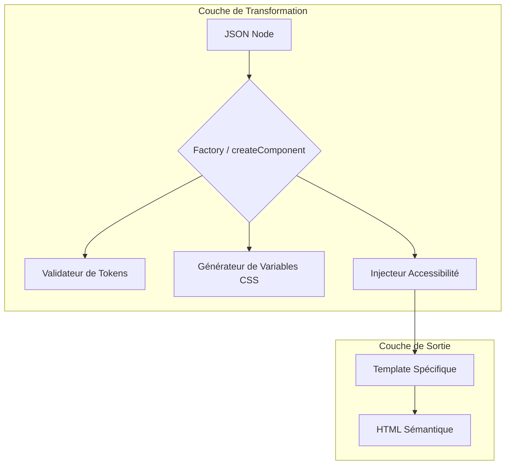
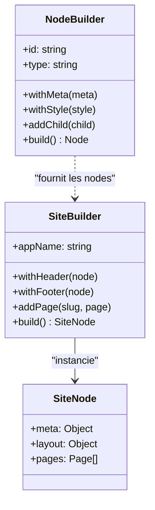

# 🏗️ Architecture Technique de CodeForge

CodeForge est un moteur de rendu déclaratif conçu selon les principes **SOLID**. Il transforme un arbre de données JSON en un document HTML sémantique et accessible.

## 1. Vue d'Ensemble du Flux de Rendu

Le processus de transformation suit un flux unidirectionnel où les données brutes traversent plusieurs couches de traitement avant de devenir du HTML.

### A. Flux de Génération (Builder vs JSON Direct)

CodeForge propose deux points d'entrée principaux pour générer une interface.

### B. Cycle de Vie du Rendu (Séquence)

## 2. Les Piliers du Système

### A. Le Renderer (Moteur de Rendu)
Le `Renderer` (`src/renderer.ts`) est une fonction récursive simple. Sa seule responsabilité est de parcourir l'arbre et d'orchestrer l'appel aux composants. Il garantit que les parents sont rendus *autour* de leurs enfants.

### B. Le Registry & La Factory
- **Registry** (`src/registry.ts`) : Un dictionnaire centralisé qui fait le lien entre une chaîne de caractères (ex: "Button") et une fonction de rendu. C'est le point d'extension unique du système.
- **Factory** (`src/utils/factory.ts`) : La fonction `createComponent` est le cœur du système. Elle agit comme un **Decorator** (Design Pattern) qui enveloppe chaque template spécifique pour injecter automatiquement les fonctionnalités transverses.

## 3. Système de Style Hybride

CodeForge sépare la structure de l'esthétique via deux types de propriétés dans l'objet `style` :

1. **Layout Utilities** : Propriétés universelles (`width`, `x`, `y`, `z-index`, etc.) directement mappées sur des styles CSS standards.
2. **Design Tokens** : Variables spécifiques au composant (ex: `btn-bg`) injectées comme **Variables CSS** (`--btn-bg`) et consommées par le template via `var(--btn-bg, fallback)`.

## 4. Accessibilité (A11y) "Zero-Config"

L'accessibilité n'est pas une option mais un composant de base. La `Factory` effectue le mapping suivant :
- `meta.audioDescription` → `aria-label`
- `meta.ariaRole` → `role`
- `meta.ariaHidden` → `aria-hidden="true"`
- Support natif de tous les autres attributs `aria-*` passés dans `meta`.

## 5. Modèle de Données et Builders

Pour faciliter la création de structures JSON complexes sans erreurs, CodeForge utilise des **Builders**.

